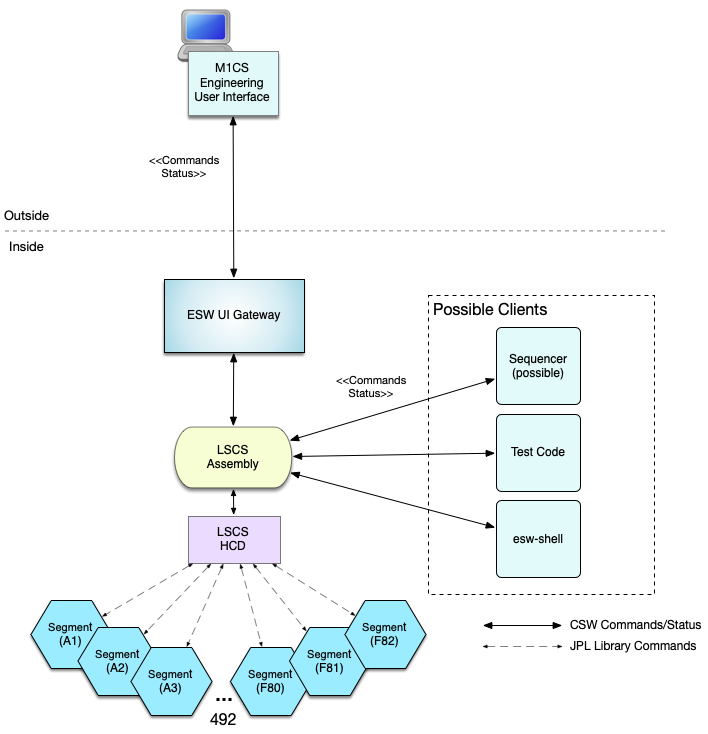

# Lower Segment Control System Demonstration

@@@ index

- @ref:[Input/Output](input-output.md)
- @ref:[LSCS Assembly](LSCSAssembly.md)
- @ref:[LSCS HCD](LSCSHcd.md)
- @ref:[LSCS Simulators](LSCSSimulator.md)
- @ref:[Assembly and HCD Deployment](Deploy.md)
- @ref:[Testing and ESW-shell](TestingAndShell.md)

@@@

This is documentation for the Lower Segment Control System (LSCS) demonstration project that is present in 
the [TMT GitHub site](https://github.com/tmtsoftware/osw-examples/tree/master/lscs-example). This project
was created to research and demonstrate potential issues around the M1CS subsystem.

In the M1CS design, there is an CSW Assembly/HCD that accepts commands that are then passed to one or more
mirror segments. Each of the 492 segments includes a Lower Segment Control System, which is running on a
specialized processor running compiled C-code. The M1CS group has defined a socket-based protocol for the LSCS, 
based on a JPL library, that wraps String-based commands.

The following figure shows the architecture targeted by this demonstration, which is based on the design of the M1CS group
placed within the CSW architecture planned for the telescope site. 



In this figure a future browser-based M1CS Engineering User Interface issues commands to the LSCS Assembly through the ESW UI Gateway.
The commands flow through the UI Gateway to the LSCS Assembly in the form of CSW Setup commands. The commands are passed to the HCD,
which understands the LSCS-protocol and has established a TCP-based connection to each of the 492 LSC segment systems. As mentioned,
the commands are Strings in the format documented in SegmentHcdCmdDict_20210902.pdf.  An example command String is:


The protocol is not described here, but involves completion information and updates when the commands take a long time. Interesting
requirements of this system is that: 1) Each LSCS can execute more than one command at a time, 2) The commands may complete
in a different order than started. 3) A command issued to the LSCS Assembly may be directed to one segment or all of the 492 segments, 
and 4) The command issued to the Assembly is only complete when the command to all 492 segments have completed. The system 
is highly asynchronous and non-blocking.

The following figure shows what is present in LSCS Demonstration.


## Demonstration Products

The deliverables of this demonstration project include:

* LCSC Assembly
* LSCS HCD
* LSCS Simulator
* Test Code

## Issues Addressed in the Demonstration

The following issues are addressed:

* The structure of the M1CS end-to-end system
* Demonstration of how to create Setups that map to LSCS commands
* Provide examples of implementing the LSCS commands (not all commands in the dictionary are provided)
* Support for sending a command to one or all segments in the HCD
* Support for sending commands to Segment using JPL protocol
* Demonstration that commands to all segments can complete when all segment commands complete
* Demonstrate that individual segment commands can complete asynchronously
* Demonstrate that a HCD can handle overlapping asynchronous commands
* Demonstrate that the CSW HCD can make 492 socket connections to the project-provided LSCS simulator
* Demonstrate that the CSW HCD can communicate with the M1CS-team's simulator
* Show how to test the code at various levels
* Demonstrate how to send commands to the LSCS Assembly from esw-shell

## Description of How Things Work

This section describes the overall design of this code and the responsibilities of each component. The previous
figure is referenced.

### Segments Assembly

The Segments Assembly is a CSW Assembly that receives commands in the form of CSW Setups. In this demonstration
implementation a Setup is constructed for a subset of the commands in the SegmentHcdCmdDict_20210902.pdf document (for more
information on the construction of Setup commands, see @ref:[Setup Input/Output](./input-output.md)). As shown in the
previous figure, these Setups can be constructed in many clients including: a future M1CS Engineering UI, a Sequencer
Script, esw-shell, or test code.

The job of the Segments Assembly in this case is minimal. It receives an Assembly Setup
and creates a Setup for the Segment HCD.  It then sends the HCD Setup to the HCD and waits asynchronously for a 
SubmitResponse.  When the SubmitResponse is received from the HCD, it forwards it to the caller.

### Segments HCD

The Segments HCD is the component that keeps track of connections to the segments. It receives HCD Setups, typically
from the Segments Assembly, but any client can send a properly formatted HCD Setup to the Segments HCD. In this 
implementation, there is one command called `lscsDirectCommand`. An instance of this command contains a formatted
LSCS command String converted by the Assembly along with the destination, which can be a single segment, or all
segments.

The Segments HCD's only job is to handle these Setups by sending the formatted command to one or all of the configured segments
and waiting for completion, which may be successful or an error.

The Segments HCD uses an actor called the SegComMonitor to send and wait for responses from the segments. Assuming
all segments complete successfully, the monitor sends a CSW Completed SubmitResponse to the caller, which in the operational
case is the Segment Assembly.  If an Error is received from a Segment, an Error SubmitResponse is returned to the caller.

When Segments HCD starts up, during its initialization, it creates connections to the segments. In the simulation the
number of segments created in each sector is specified by a configuration value in the resource.conf file block as
shown below. Setting the value segments to 82 results in a full mirror configuration.  Each of the 6 sectors (A-F) 
always gets the same number of segments.  For instance if the configuration value is 2, the segments 
A1, B1, C1, D1, E1, F1, A2, B2, C2, D2, E2, F2 are created.  The external socket connection is made when the segment is created.

The following snippet shows the configuration section of reference.conf. 

```scala
m1cs {
  segments = 10
  simulatorExternal = false
}
```

@@@ warning
This configuration value is present because on the macOS it is not possible to create 492 segment connections with the
simulator.  If you are working on Linux, this value can be set to the maximum value of 82.  This is not a limitation
on CSW, there is some issue or parameter in macOS that we have not discovered, and since Linux is our target platform,
we are not concerned.
@@@

@@@ note { title=Note }
There is the start of code to allow creation of ranges of sectors. The thought was that segments may be added in unknown
patterns. After hearing this was not needed, that feature was stopped, but this code still exists for future use.
It would not be too hard to complete this support.
@@@

### Segment Actor

The Segments HCD creates a Segment Actor for each configured Segment. The Segment Actor provides an API to the caller that is simple
and largely based on the description of the M1CS protocol (Started, Completed, etc.)  Each Segment Actor manages a
socket-based connection to a segment.  In the demonstration, this is a socket connection to the simulator. The Segment Actor and 
its segment are addressed through their SegmentId, which is a sector [A-F] followed by a segment number [1-82] or,
for example, C32.

### LSCS Simulator

A JVM-based Simulator has been provided as part of the demonstration. The formatted LSCS command is sent to the simulator, 
but the simulator does not implement the LSCS commands.  For every command, the JVM simulator delays a 
random amount of time and returns Completed in the JPL protocol.

The Segment Actor communicates with the JVM-based Simulator using the JPL protocol as implemented in the C-based library 
(to the best of our knowledge). This could be improved but for the goals of this demonstration, it is not necessary.

The JVM-based Simulator is needed because the M1CS C-based Simulator does not allow demonstration of the goals of this
project (at this time). However, if `segments` is set low enough and the tests are simple enough, the demonstration
code works properly with the M1CS Simulator as well. As the M1CS simulator is enhanced it will be possible to
use the C-based simulator with the identical code.  (It would also be possible to enhance the Scala-based simulator, but using the C-based library
is probably a good idea.)

Please see the other pages for a bit more detail one each of these subjects.